# Arth — Your Finance, Your Way

**Arth** is a personal finance app for Android that keeps your data entirely on your phone. No account, no cloud, no subscription, ever. Your transactions, balances, and spending patterns stay where they belong.

**Self-sustaining SMS intelligence.** Arth reads bank and payment SMS messages to log transactions automatically. What sets it apart: if your bank introduces a new SMS format, you do not need to wait for an app update. You can write your own parsing template directly inside the app, teach Arth the new pattern once, and it handles every matching message from that point on. The app adapts to your banks, not the other way around.

**A complete financial picture, not just a tracker.** Arth covers every layer of your finances in one place: savings accounts, credit cards, wallets, loans with full amortisation and prepayment schedules, EPFO and pension accounts, and a family lending ledger (Hisaab) for tracking money you lend or borrow. Bank statement reconciliation lets you match PDF statements against your logged transactions to catch anything that slipped through.

**Reports and insights that go beyond the basics.** Monthly spending breakdowns, budget vs. actual comparisons, category-level drill-downs, year-over-year trends, and a savings rate view tied to your fiscal year give you a clear read on where your money actually goes. Smart Rules auto-categorise recurring transactions so the data stays clean without manual effort.

**Knows what isn't spending.** Opening a fixed deposit, moving money to your other bank, a SIP auto-debit, an FD paying out: Arth spots these in your bank SMS and asks once with a one-tap card, so they don't show up as spending or income. Transfers between your own accounts are paired into a single transfer automatically, whichever side's SMS arrives first.

**Plan, simulate, and protect.** The goals section brings together your yearly savings plan, investment milestones, net worth balance sheet, and active loans in one view. The cash flow simulator lets you model future scenarios before committing to them. A built-in vault keeps sensitive credentials and notes secure and offline alongside everything else.

Built with React Native and Expo. Open source. No data leaves your phone.

**Current version: v4.8.1** · [All releases](https://github.com/kaiser7292/arth/releases)

---

## Screenshots

<table>
<tr>
<td align="center">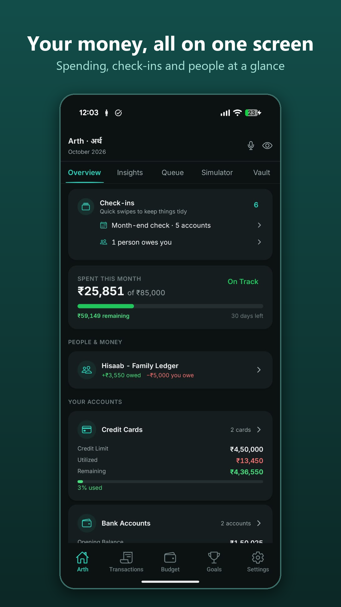<br><sub>Your money on one screen</sub></td>
<td align="center">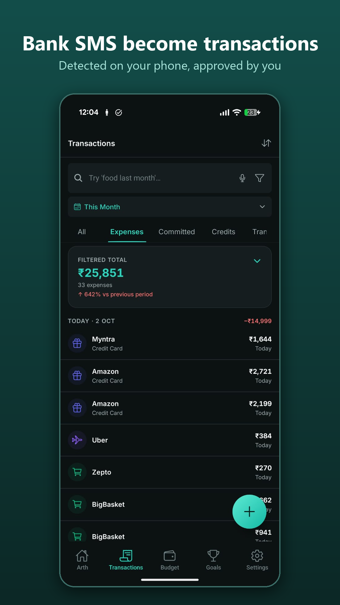<br><sub>Bank SMS become transactions</sub></td>
<td align="center">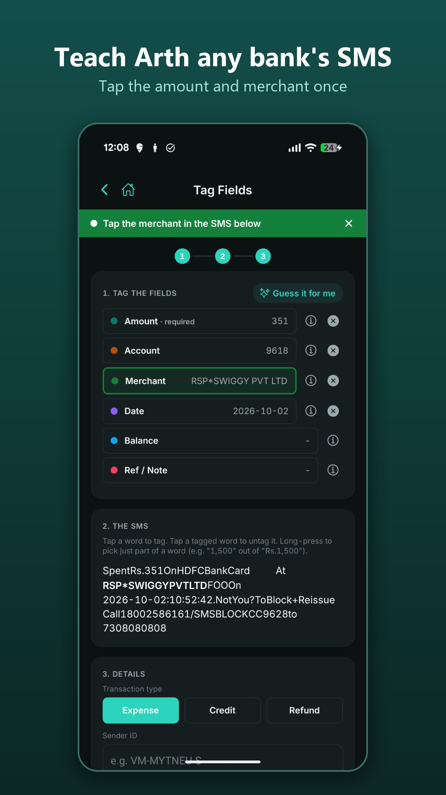<br><sub>Teach Arth any bank's SMS</sub></td>
<td align="center">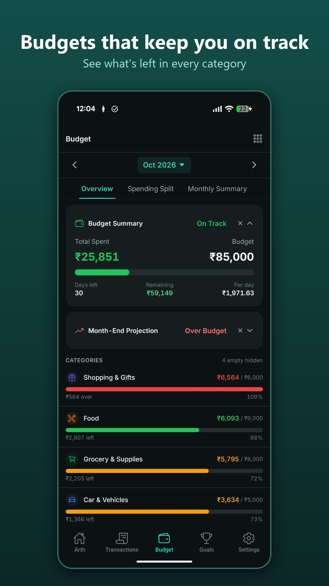<br><sub>Budgets by category</sub></td>
</tr>
<tr>
<td align="center">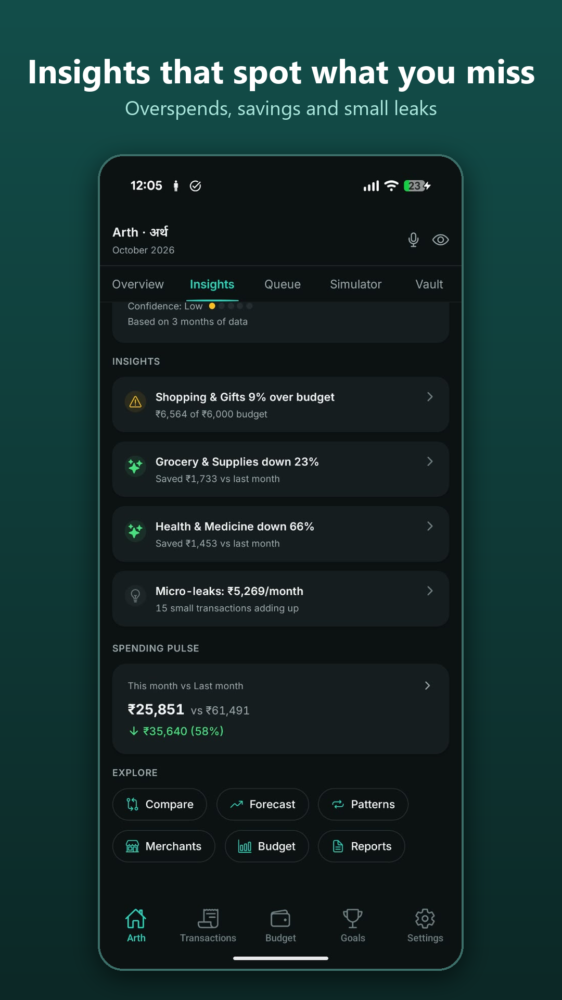<br><sub>Insights</sub></td>
<td align="center">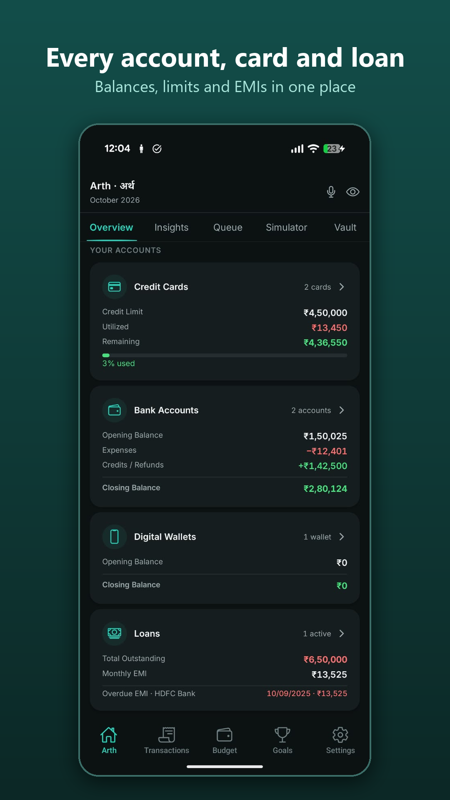<br><sub>Accounts, cards and loans</sub></td>
<td align="center">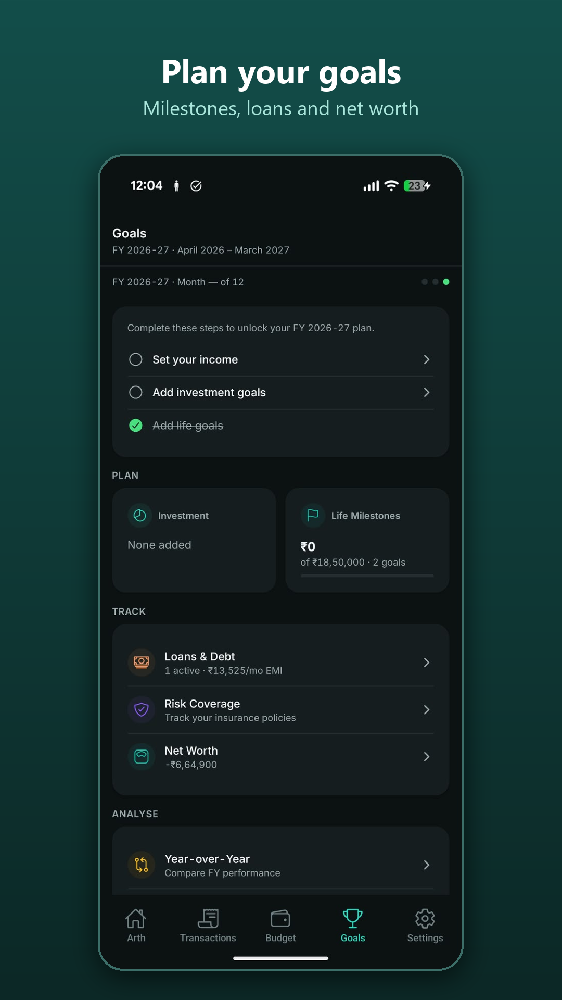<br><sub>Goals and net worth</sub></td>
<td align="center">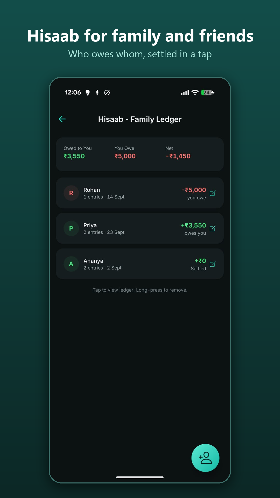<br><sub>Hisaab family ledger</sub></td>
</tr>
<tr>
<td align="center">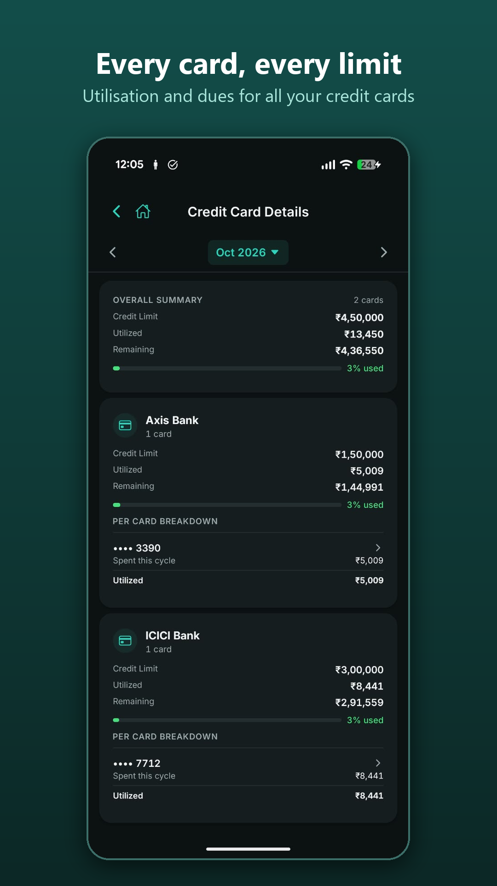<br><sub>Every card, every limit</sub></td>
<td align="center">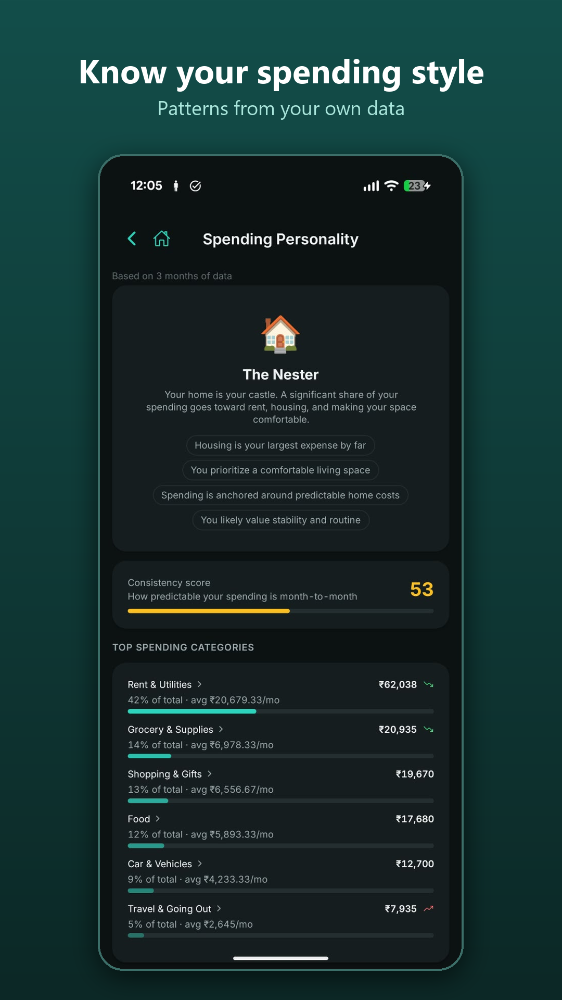<br><sub>Spending personality</sub></td>
<td align="center">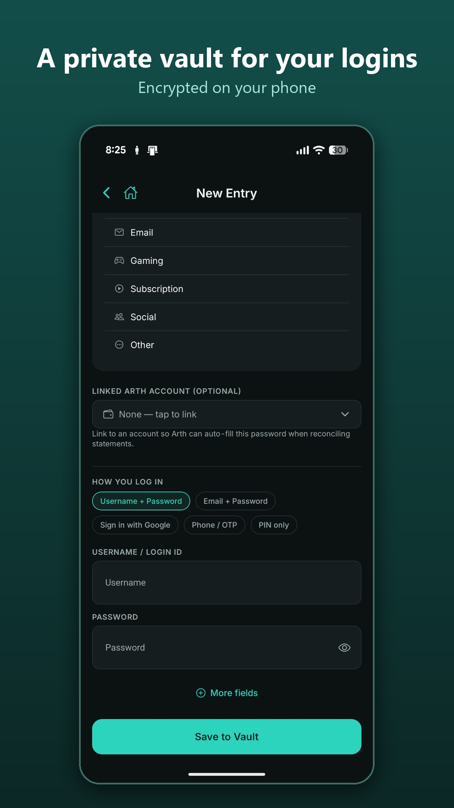<br><sub>Private vault</sub></td>
<td align="center">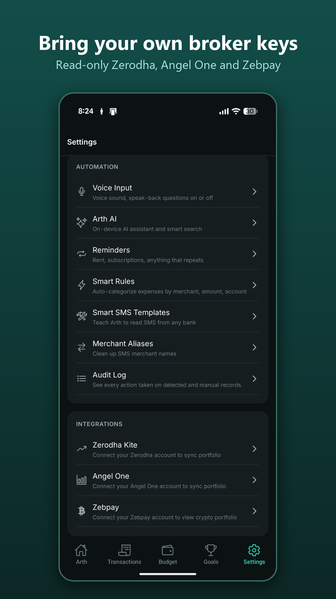<br><sub>Broker integrations</sub></td>
</tr>
<tr>
<td align="center">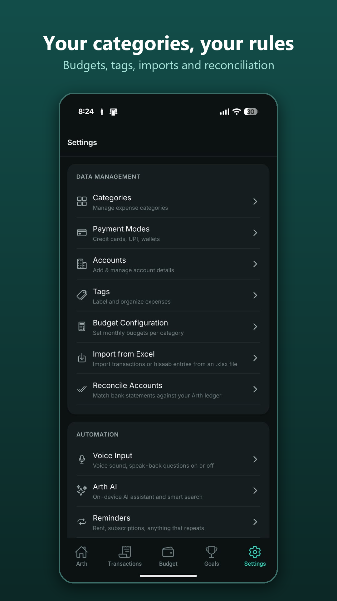<br><sub>Settings</sub></td>
</tr>
</table>

<sub>Screens show sample data.</sub>

---

## Features

### Expense Tracking
- Manual entry and automatic detection from bank SMS (25+ Indian banks — private and PSU)
- One form for everything: **Spent · Received · Transfer**, with a suggested category as you type, credit types (Salary, Interest, Refund, Cashback, Reimbursement, Gift, Other), less-used fields under More options, and the account you used last time
- Review queue: all auto-detected data goes through approve / edit / reject before counting in balances
- **Catch Up** — review new transactions one card at a time; swipe to approve or skip, with undo
- Approve or reject straight from the notification when Arth spots a new bank SMS in the background
- Duplicate detection with one-tap resolution
- Expense splits — equal, I owe full, they owe full, by percentage, or by exact amount
- Hisaab settlements — mark a credit as repayment from a split
- Refund tracking — link refund credits back to the original expense
- Split-tender purchases — log a single purchase paid across multiple accounts/cards
- Tags, merchant names, categories, payment modes
- Smart Rules — auto-categorize, tag, set payment mode, description, auto-approve, and split based on merchant/amount/category conditions; apply retroactively to past expenses
- Formula input — type `=10000*18%` in any amount field; live preview evaluates on blur
- Recycle bin — 30-day recovery for all deleted expenses

### Accounts & Reconciliation
- **Savings / Bank accounts** — monthly ledger with opening/closing balance chain
- **Credit cards** — utilized balance model, monthly statement reconciliation
- **Wallets** — UPI wallets, cash
- **Demat portfolio** — snapshot-based P&L, invested vs current value, idle fund tracking
- **Fixed deposits** — maturity schedule, interest, link to an investment bucket; opened and closed straight from bank SMS, including early closures
- **Pension / EPFO** — contribution tracking with YTD summary
- **Loans** — full amortization schedule, prepayment (reduce-tenure or reduce-EMI), manual corrections
- Account transfers with inter-account navigation
- Reclassify any expense or credit as a transfer without re-entering data
- Transfers between your own accounts paired automatically from both sides' SMS (using your name as banks print it)
- Credit card bills: part payments leave the remainder showing as still due
- Close / reopen accounts — closed accounts are hidden from active views but history remains fully browsable

### Goals & Planning
- **Investment Buckets** — track contributions against yearly targets
- **Life Milestones** — savings goals with projected completion dates
- **Net Worth** — assets and liabilities by section (cash, investments, receivables, credit, debt, payables)
- **SIPs** — mutual-fund auto-debits detected and linked to investment buckets, so they count as investing, not spending
- **Year-over-Year** — multi-year income, expense, and savings comparison
- **Financial Health** — scored grade (A+ to F) across savings rate, debt, diversification, emergency fund, and spending discipline; detailed report available in Settings
- **Retirement Report** — readiness score, drawdown timeline, insurance coverage adequacy
- **Income Calculator** — take-home pay under old or new Indian tax regime, for salaried and business / freelance income, with advance tax

### Cashflow Simulator
- Simulates projected account balances using approved expenses, upcoming dues, and forecasts
- Links simulator entries to realized transactions for tracking plan vs actual

### Recurring Reminders
- Set reminders on any expense (weekly, monthly, quarterly, yearly)
- Home card auto-matches due reminders to exact-amount expenses — approve, skip, or dismiss inline
- Reminder detail screen with full fulfillment history
- Linked reminder badge on expense detail taps through to the reminder

### Family Ledger (Hisaab)
- Track money lent to or borrowed from anyone
- Running balance per person with settlement history
- Linked to expenses — expense splits automatically create hisaab entries

### Integrations (optional)
- **Zerodha Kite**, **Angel One** and **Zebpay** — holdings, positions, SIPs and orders; credentials kept encrypted in the on-device Vault

### Insurance & Risk Coverage
- Track term, health, home, car, and life insurance policies
- Coverage adequacy heuristics (10× income for term, ₹10L/member for health)
- Integrated into retirement report readiness score

### Insights & Analytics
- Monthly spend vs budget with category breakdown
- Trends, period comparisons, spending patterns
- Right-spend vs discretionary split
- Spending spike detection (categories 2× above 3-month average)
- Date-grouped transaction history (Today / Yesterday / day / date)

### SMS Auto-Detection
- Reads bank SMS from the Android inbox on demand or on a schedule
- First run: choose 1, 3 or 6 months of history and get a "Here's your money" summary
- 25+ supported banks out of the box (14 private, 11 PSU + EPFO, insurance), including SBI and HDFC savings-account formats as sent in 2026
- Smart SMS Templates — teach the app new SMS formats using a visual tag-builder; flexible matching survives reworded messages, Auto type reads credits and debits with one template, and saving one reads your past unread messages too
- Scan Runs history — inspect every parsed, filtered, or unrecognized SMS after a scan
- Scan filtering by account so only relevant SMS are processed
- **Send to developer** — share an unrecognised SMS with names, account numbers and balances hidden, from your own email app

### Backup & Restore
- AES-256-GCM encrypted backups with a user-set password (`.arth` format, backward-compatible with `.artha`)
- Scheduled auto-backup: configurable interval (4h / 6h / 8h / 12h / 24h / 48h), notification-triggered execution
- Safety checkpoints: silent auto-backup before any destructive delete — up to 10 kept, one-tap restore
- Share any backup file directly from the settings screen

### Privacy
- **Hide amounts** — one tap masks every money figure in the app
- Biometric app lock; on-device Password Vault

---

## Tech Stack

| Layer | Technology |
|-------|-----------|
| Framework | React Native + Expo SDK 53 |
| Navigation | Expo Router (file-based routing) |
| Styling | NativeWind (Tailwind CSS for React Native) |
| Database | expo-sqlite (local, on-device) |
| KV Store | react-native-mmkv |
| SMS | react-native-get-sms-android |
| Animations | react-native-reanimated |
| AI | llama.rn (on-device, Llama 3.2 3B) |
| Testing | Jest + React Native Testing Library |
| Build | Local Gradle (`gradlew assembleRelease`) |

---

## Project Structure

```
artha/
├── app/                    # Expo Router pages (file-based routing)
│   ├── (tabs)/             # Bottom tab screens (Home, Transactions, Budget, Goals, Settings)
│   ├── expense/            # Expense add / edit / review
│   ├── reconciliation/     # Account ledger, credit cards, wallets, pension, demat
│   ├── goals/              # Yearly plan, balance sheet, milestones, YoY, loans
│   ├── insights/           # Analytics, comparisons, patterns
│   ├── simulator/          # Cash-flow simulator
│   ├── hisaab/             # Family ledger
│   ├── settings/           # All settings screens
│   └── summary/            # Monthly summaries
├── components/             # Reusable UI components
├── services/               # Business logic (150+ service files)
│   └── sms/                # SMS reading, parsing, orchestration, templates
├── database/               # SQLite schema + 77 migration files (schema version 080)
├── utils/                  # Helpers, formatters, validators
├── constants/              # Theme, config, category defaults
├── hooks/                  # Custom React hooks
└── assets/                 # Images, fonts, bundled data, help articles
```

---

## Version History

| Version | Highlights |
|---------|-----------|
| **v4.8** | Record money back from any investment (MF, stocks, PPF, NPS, EPF) with gain split, bucket and close; redemption SMS detection; daily demat statement (money in/out and market gain per day); Investments 12-month stacked chart with % legend and per-account drill-down; broker-synced snapshots stay the truth for their day; Catch Up merchant and payment mode chips, and card edits carry into Edit |
| **v4.7** | Month-end projection uses the same spending rule as the budget (no transfers or loan payments) and the median month; rebuilt bill-pattern learning; "Monthly bills" check-in |
| **v4.6** | Smart SMS Templates: flexible matching, Auto money-in/out type, read past unread messages into review, configurable look-back, learn from several examples, grouped Unrecognised list, name and other-account fields |
| **v4.5** | FD, own-account transfer and SIP detection with one-tap review cards; SBI/HDFC 2026 SMS formats; first-run "Here's your money"; new Spent · Received · Transfer form with credit types; card-bill part payments; Send unrecognised SMS to developer |
| **v4.4** | Catch Up descriptions; FD → bucket link while adding; choose which Hisaab people count in net worth; new EPF wage ceiling |
| **v4.3** | Income Calculator for business / freelance income, other income, advance tax; help centre refresh |
| **v4.1 – v4.2** | Zerodha login filled from the Vault (user ID, password, TOTP) |
| **v4.0** | Catch Up swipe review; approve from notifications; Home check-ins (month-end, settle up, subscriptions, rule suggestions) |
| **v3.13 – v3.16** | Zerodha Kite, Angel One and Zebpay integrations |
| **v3.10 – v3.12** | Hide amounts; FD maturity through review; under-the-hood consolidation |
| **v3.2 – v3.9** | Fixed deposits; unified Investments (demat, pension, FD); Mark as Fixed Deposit; Net Worth sections |
| **v3.0 – v3.1** | Design system revamp: teal brand, Inter, tabular figures; one shared bottom sheet |
| **v2.x** | Smart Rules, Financial Health and Retirement reports, insurance coverage, Password Vault, on-device AI assistant, Smart SMS Templates, swipe pages |

Full notes for every version: [GitHub Releases](https://github.com/kaiser7292/arth/releases).

---

## Architecture Notes

- **100% local** — no server, no sync, no telemetry. SQLite is the single source of truth.
- **Balance chain model** — `account_month_balances` anchors each account's opening balance per month; closing = opening ± transactions.
- **SMS pipeline** — four-stage: reader → parser → orchestrator → expense creator. All outcomes are logged for inspection in Scan Runs.
- **Review queue** — auto-detected data always goes through approve/edit/reject before affecting budgets or balances.
- **Soft delete** — `deleted_at` column everywhere; 30-day auto-purge; restorable from recycle bin.
- **Fiscal Year** — April–March (configurable). Drives yearly plans, savings rates, and year-over-year comparison.

---

## License

MIT License

Copyright (c) 2026 [Sourav Baid](https://www.linkedin.com/in/souravbaid/)

Permission is hereby granted, free of charge, to any person obtaining a copy of this software and associated documentation files (the "Software"), to deal in the Software without restriction, including without limitation the rights to use, copy, modify, merge, publish, distribute, sublicense, and/or sell copies of the Software, and to permit persons to whom the Software is furnished to do so, subject to the following conditions:

The above copyright notice and this permission notice shall be included in all copies or substantial portions of the Software.

THE SOFTWARE IS PROVIDED "AS IS", WITHOUT WARRANTY OF ANY KIND, EXPRESS OR IMPLIED, INCLUDING BUT NOT LIMITED TO THE WARRANTIES OF MERCHANTABILITY, FITNESS FOR A PARTICULAR PURPOSE AND NONINFRINGEMENT. IN NO EVENT SHALL THE AUTHORS OR COPYRIGHT HOLDERS BE LIABLE FOR ANY CLAIM, DAMAGES OR OTHER LIABILITY, WHETHER IN AN ACTION OF CONTRACT, TORT OR OTHERWISE, ARISING FROM, OUT OF OR IN CONNECTION WITH THE SOFTWARE OR THE USE OR OTHER DEALINGS IN THE SOFTWARE.
